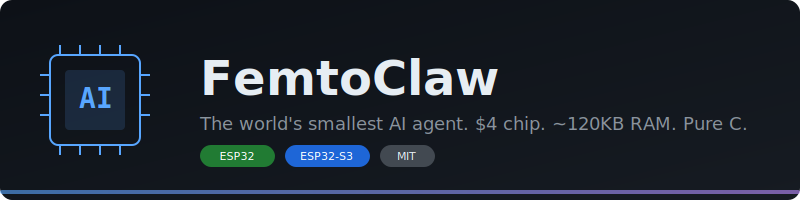
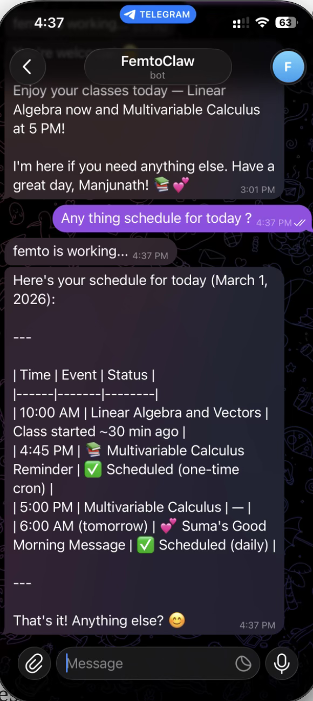
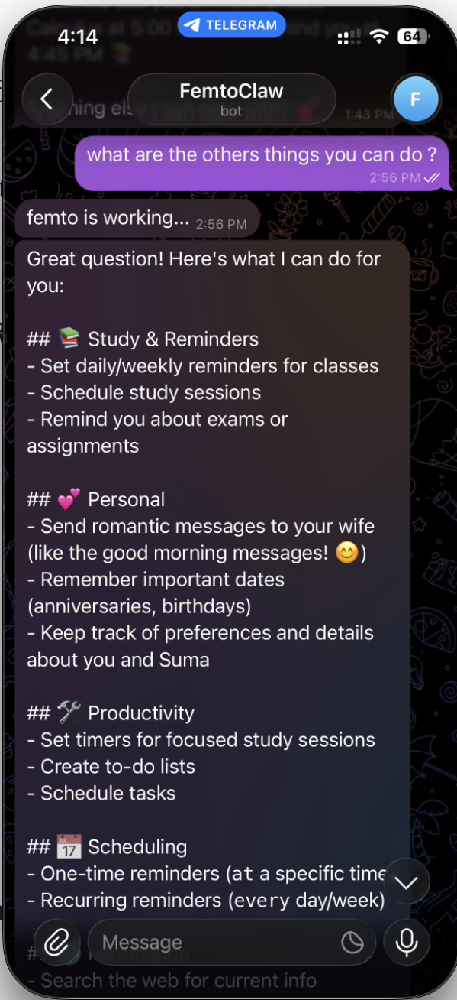
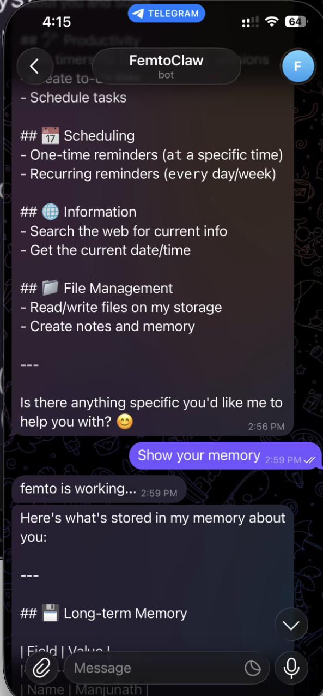
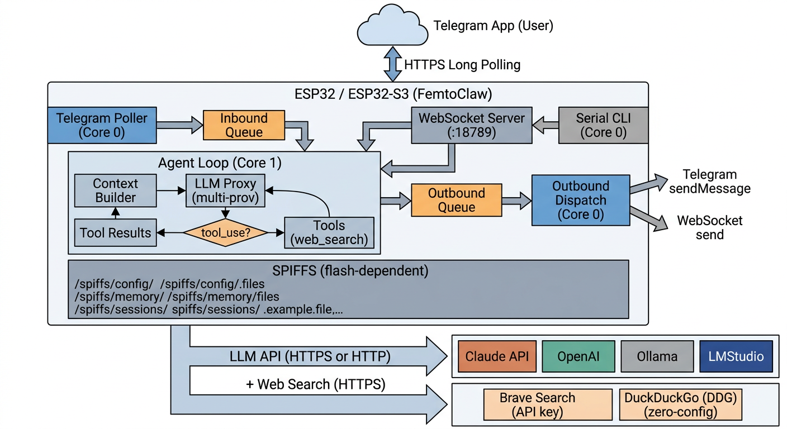

# FemtoClaw: AI Agent on a $4 Chip

<p align="center">
  
</p>

<p align="center">
  <a href="LICENSE"></a>
</p>


**The world's smallest AI agent. No Linux. No Node.js. Just pure C on a $4 ESP32.**

FemtoClaw runs a full AI agent on bare-metal ESP32 hardware. It connects to WiFi, talks through Telegram, calls tools, remembers across reboots, and schedules its own tasks — all on a chip with ~120KB of free RAM.

## See it in Action

<p align="center">
  
  &nbsp;&nbsp;
  
  &nbsp;&nbsp;
  
</p>

## Why FemtoClaw?

| | FemtoClaw | MimiClaw | Nanobot | OpenClaw |
|---|---|---|---|---|
| **Hardware** | ESP32 / ESP32-S3 | ESP32-S3 only | Linux SBC | Linux server |
| **Cost** | **$4** | $10 | $35+ | $100+ |
| **RAM** | ~120KB / ~8MB | ~8MB | 512MB+ | GB+ |
| **Language** | C | C | Python | Node.js |
| **PSRAM required** | No | Yes | N/A | N/A |
| **Zero-config search** | DDG fallback | API key only | API key | Default |
| **GPIO control** | **Yes** | No | No | No |
| **Remote config** | **Planned** | No | No | No |

## Key Features

- **Dual-target** — runs on both $4 ESP-WROOM-32 (no PSRAM) and $10 ESP32-S3 (8MB PSRAM)
- **Zero-config web search** — DuckDuckGo fallback when no Brave API key is set
- **SNTP time sync** — automatic time from NTP servers, configurable timezone
- **Agent loop** — ReAct pattern with tool calling (web search, file ops, cron, messaging, time, GPIO)
- **Persistent memory** — SOUL.md personality, MEMORY.md long-term memory, daily notes
- **Telegram + WebSocket** — message it from anywhere
- **Cron scheduler** — the AI schedules its own recurring tasks
- **Heartbeat** — periodically checks a task file and acts autonomously
- **Multi-provider** — Anthropic (Claude) and OpenAI (GPT), switchable at runtime
- **OTA updates** — flash new firmware over WiFi
- **GPIO control** — drive LEDs, relays, and buzzers via chat with safe pin allowlists, blink, and chase animations
- **HTTP proxy** — CONNECT tunnel for restricted networks

## Architecture

<p align="center">
  
</p>

See **[docs/ARCHITECTURE.md](docs/ARCHITECTURE.md)** for the full system design, module map, and data flow.

## Quick Start

### What You Need

**For ESP-WROOM-32 ($4 board):**
- An ESP-WROOM-32 dev board with 4MB flash (no PSRAM needed)
- A USB micro cable

**For ESP32-S3 ($10 board):**
- An ESP32-S3 dev board with 16MB flash + 8MB PSRAM
- A USB Type-C cable

**For both:**
- A [Telegram bot token](https://t.me/BotFather)
- An [Anthropic API key](https://console.anthropic.com) or [OpenAI API key](https://platform.openai.com)

### Install

```bash
# Install ESP-IDF v5.5+ first:
# https://docs.espressif.com/projects/esp-idf/en/v5.5.2/esp32s3/get-started/

git clone https://github.com/manjunathshiva/femtoclaw.git
cd femtoclaw

# Choose your target:
idf.py set-target esp32       # for ESP-WROOM-32 ($4)
idf.py set-target esp32s3     # for ESP32-S3 ($10)
```

<details>
<summary>Ubuntu Install</summary>

```bash
sudo apt-get update
sudo apt-get install -y git wget flex bison gperf python3 python3-pip python3-venv \
  cmake ninja-build ccache libffi-dev libssl-dev dfu-util libusb-1.0-0

./scripts/setup_idf_ubuntu.sh
./scripts/build_ubuntu.sh
```

</details>

<details>
<summary>macOS Install</summary>

```bash
xcode-select --install
/bin/bash -c "$(curl -fsSL https://raw.githubusercontent.com/Homebrew/install/HEAD/install.sh)"

./scripts/setup_idf_macos.sh
./scripts/build_macos.sh
```

</details>

### Configure

```bash
cp main/femto_secrets.h.example main/femto_secrets.h
```

Edit `main/femto_secrets.h`:

```c
#define FEMTO_SECRET_WIFI_SSID       "YourWiFiName"
#define FEMTO_SECRET_WIFI_PASS       "YourWiFiPassword"
#define FEMTO_SECRET_TG_TOKEN        "123456:ABC-DEF1234ghIkl-zyx57W2v1u123ew11"
#define FEMTO_SECRET_API_KEY         "sk-ant-api03-xxxxx"
#define FEMTO_SECRET_MODEL_PROVIDER  "anthropic"     // "anthropic" or "openai" (LM Studio/Ollama use "openai")
#define FEMTO_SECRET_API_BASE_URL    ""              // optional: e.g. "http://192.168.1.100:1234" for LM Studio
                                                     //          e.g. "http://192.168.1.100:11434" for Ollama
#define FEMTO_SECRET_SEARCH_KEY      ""              // optional: Brave Search API key (DuckDuckGo used by default)
#define FEMTO_SECRET_TIMEZONE        ""              // optional: e.g. "IST-5:30"
```

> **Local LLMs:** FemtoClaw supports [LM Studio](https://lmstudio.ai) and [Ollama](https://ollama.com) via the OpenAI-compatible API. Set `MODEL_PROVIDER` to `"openai"` and `API_BASE_URL` to your local server address.

Build and flash:

```bash
idf.py fullclean && idf.py build

# Find your serial port
ls /dev/cu.usb*          # macOS
ls /dev/ttyACM*          # Linux

# First-time flash (writes firmware + SPIFFS storage with default files)
idf.py -p PORT flash monitor

# Subsequent flashes (firmware only — preserves memory, cron jobs, sessions)
idf.py -p PORT app-flash monitor
```

> **ESP32-S3 users:** Plug into the **USB** port, not the **COM** port.
>
> **Preserving data:** Use `app-flash` instead of `flash` after initial setup. `flash` overwrites the SPIFFS partition, wiping MEMORY.md, cron.json, sessions, and daily notes. `app-flash` only updates the firmware binary.

### CLI Commands

Connect via serial to configure or debug:

**Runtime config** (saved to NVS, overrides build-time defaults):

```
femto> set_wifi MySSID MyPassword     # change WiFi
femto> set_tg_token 123456:ABC...     # change Telegram bot token
femto> set_api_key sk-ant-api03-...   # change API key
femto> set_model_provider openai      # switch provider
femto> set_model gpt-4o              # change model
femto> set_proxy 192.168.1.83 7897   # set HTTP proxy
femto> clear_proxy                    # remove proxy
femto> set_search_key BSA...          # set Brave Search API key
femto> config_show                    # show all config
femto> config_reset                   # clear NVS, revert to defaults
```

**Debug & maintenance:**

```
femto> wifi_status              # connection status
femto> wifi_scan                # scan nearby APs
femto> memory_read              # see what the bot remembers
femto> heap_info                # RAM usage
femto> session_list             # list all sessions
femto> skill_list               # list installed skills
femto> heartbeat_trigger        # manually trigger heartbeat
femto> cron_start               # start cron scheduler
femto> restart                  # reboot
```

## Memory

FemtoClaw stores everything as plain text files on SPIFFS flash:

| File | What it is |
|------|------------|
| `SOUL.md` | The bot's personality |
| `USER.md` | Info about you — name, preferences, language |
| `MEMORY.md` | Long-term memory — persists across reboots |
| `HEARTBEAT.md` | Task list the bot checks and acts on autonomously |
| `cron.json` | Scheduled jobs created by the AI |
| `2026-02-05.md` | Daily notes |
| `tg_12345.jsonl` | Chat history |

## Tools

FemtoClaw supports tool calling for both Anthropic and OpenAI (ReAct pattern):

| Tool | Description |
|------|-------------|
| `web_search` | Search via Brave API or DuckDuckGo fallback |
| `get_current_time` | Get current date/time (SNTP synced) |
| `read_file` | Read a file from SPIFFS |
| `write_file` | Write/overwrite a file on SPIFFS |
| `edit_file` | Find-and-replace edit on SPIFFS |
| `list_dir` | List files on SPIFFS |
| `cron_add` | Schedule a recurring or one-shot task |
| `cron_list` | List scheduled cron jobs |
| `cron_remove` | Remove a cron job by ID |
| `send_message` | Send a message immediately to Telegram or WebSocket |
| `gpio_control` | Set/read GPIO pins, blink, or run chase sequences on LEDs/relays/buzzers — safe pin allowlist enforced |

### GPIO Control

FemtoClaw can control hardware GPIO pins directly from Telegram. Connect LEDs, relays, or buzzers to safe pins and control them through chat.

**Wiring:** Connect an LED's long leg (+) to a GPIO pin (e.g. GPIO 1 on S3, GPIO 25 on ESP32), add a 220Ω resistor between the short leg (-) and GND.

**Example chat commands:**

| You say | What happens |
|---------|-------------|
| "Turn on the LED on pin 1" | Sets GPIO 1 HIGH |
| "Turn it off" | Sets GPIO 1 LOW |
| "Blink pin 1 every 500ms" | Starts blinking with a hardware timer |
| "Run a chase on pins 1,2,3,4,5" | One LED lights at a time, moving across pins |
| "Blink pin 1 at 500ms and pin 2 at 1 second" | Both blink independently (up to 8 concurrent animations) |
| "Stop all animations" | Stops everything, all pins LOW |

**Safe pins (compile-time allowlist):**
- **ESP32-WROOM-32:** 2, 4, 5, 12–15, 18–19, 22–23, 25–27, 32–33
- **ESP32-S3:** 1–18, 21, 38–42, 48

Boot, flash, UART, and PSRAM pins are excluded to prevent bricking.

## Skills

FemtoClaw comes with built-in skills and supports custom ones:

- **weather** — get current weather via web search
- **daily-briefing** — compile a personalized daily update
- **skill-creator** — create new skills from natural language

Create your own by writing markdown files to `/spiffs/skills/`.

## Also Included

- **WebSocket gateway** on port 18789
- **OTA updates** over WiFi
- **Dual-core processing** (ESP32-S3)
- **HTTP proxy** support
- **Cron scheduler** with persistent jobs
- **Heartbeat** for autonomous task execution

## Roadmap

### Phase 1 — Quick Wins

| Feature | Target | Description | Priority | Status |
|---------|--------|-------------|----------|--------|
| System info tool | Both | Return heap, uptime, WiFi RSSI, chip temp for self-monitoring | High | Planned |
| Send message tool | Both | Let the agent proactively send messages to Telegram from cron/heartbeat | High | **Done** |
| GPIO control tool | Both | Set/read GPIO pins to drive LEDs, relays, buzzers with safe pin allowlist | High | **Done** |
| Telegram allowlist | Both | Restrict bot access to configured chat_ids only | High | Planned |
| HTTP fetch tool | S3 only | Fetch URL content, strip HTML, return text to LLM (needs PSRAM for usable buffer sizes) | High | Planned |

### Phase 2 — Smarter Agent

| Feature | Target | Description | Priority | Status |
|---------|--------|-------------|----------|--------|
| Remote config via Telegram | Both | Switch model/provider, show config, heap info, WiFi status, and reboot from Telegram chat | High | Planned |
| API key rotation | Both | Store multiple API keys, auto-retry on 429 rate limit | Medium | Planned |
| Model failover | Both | Primary model → fallback chain on errors | Medium | Planned |
| Session compaction | S3 only | Summarize older messages when history exceeds limit (needs 16KB+ context buffer) | High | Planned |
| Auto memory flush | S3 only | Extract key facts into MEMORY.md before compaction (needs PSRAM for dual-buffer LLM call) | Medium | Planned |

### Phase 3 — More Channels & Integrations

| Feature | Target | Description | Priority | Status |
|---------|--------|-------------|----------|--------|
| Webhook endpoint | Both | `POST /hooks/wake` to trigger agent from external systems (Home Assistant, IFTTT) | Medium | Planned |
| Discord bot | S3 only | Second messaging channel via Discord Bot API (needs 3rd TLS connection, ~60KB extra RAM) | Medium | Planned |
| Web dashboard | S3 only | Serve simple HTML control panel from SPIFFS (needs PSRAM + 16MB flash for assets) | Low | Planned |

### Phase 4 — Polish

| Feature | Target | Description | Priority | Status |
|---------|--------|-------------|----------|--------|
| Weather tool | Both | Direct OpenWeatherMap API calls (free tier, no web search overhead) | Low | Planned |
| Gemini provider | Both | Native Google Gemini API support (different auth format) | Low | Planned |
| Skill enable/disable | Both | Toggle skills on/off without deleting them | Low | Planned |
| Skill install from URL | S3 only | `skill_install <url>` to download skill files from the web (needs 16MB flash for SPIFFS space) | Low | Planned |

## For Developers

- **[docs/ARCHITECTURE.md](docs/ARCHITECTURE.md)** — system design, module map, memory budget
- **[docs/TODO.md](docs/TODO.md)** — feature tracker and roadmap

## Contributing

Please read **[CONTRIBUTING.md](CONTRIBUTING.md)** before opening issues or pull requests.

## License

MIT

## Acknowledgments

FemtoClaw is inspired by and forked from [MimiClaw](https://github.com/memovai/mimiclaw) by Ziboyan Wang. FemtoClaw extends MimiClaw with ESP-WROOM-32 support, zero-config web search, SNTP time sync, and dual-target builds.

Built by [Manjunath Janardhan](https://github.com/manjunathshiva).
